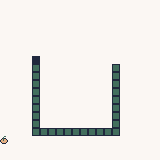

WASM-4 Snake
====

A snake clone for the [WASM-4 Fantasy Console](https://wasm4.org/)

It was a first approach to get started with developing games for WASM-4.

Meanwhile there is a much cleaner [Snake Rust implementation](https://github.com/FaberVitale/snake-w4-rs) from [FaberVitale](https://github.com/FaberVitale) and a matching written Tutorial. You can find it on the [official website](https://wasm4.org/) in the [Tutorials section](https://wasm4.org/docs/tutorials/snake/setup-project/?code-lang=rust).